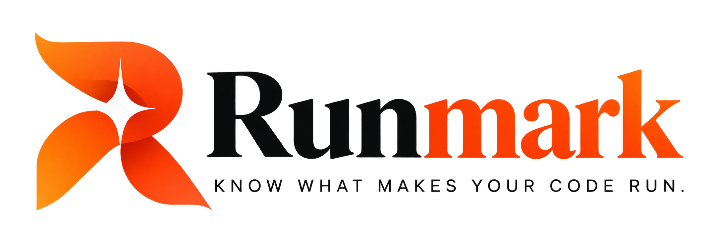

<p align="center">
  <picture>
    <source media="(prefers-color-scheme: dark)" srcset="public/images/logo-runmark.png">
    
  </picture>
</p>

<p align="center">
  <strong>Know what makes your code run.</strong><br>
  <em>Git tracks your code. Runmark tracks what makes your code run.</em>
</p>

<p align="center">
  <a href="https://runmark.live"></a>
  <a href="https://github.com/byanjanstarlord-arch/Runmark/releases"></a>
  <a href="https://nextjs.org"></a>
  <a href="https://www.typescriptlang.org"></a>
  <a href="https://tailwindcss.com"></a>
  <a href="https://greensock.com/gsap"></a>
  <a href="https://github.com/byanjanstarlord-arch/Runmark/blob/main/LICENSE"></a>
</p>

---

## ⚡ Overview

**[Runmark Website (runmark.live)](https://runmark.live)** is the official modern web application for [Runmark](https://github.com/byanjanstarlord-arch/Runmark) — a local-first development environment observability, fingerprinting, comparison, and verification tool designed to eliminate *"works on my machine"* forever.

Built with **Next.js 14 App Router**, **TypeScript**, **Tailwind CSS**, and **GSAP**, this site delivers a high-craft, interactive editorial experience with buttery-smooth animations, tactile micro-interactions, and real-time environment simulation demos. Explore it live at **[https://runmark.live](https://runmark.live)**.

---

## ✨ Key Experiences & Features

- **Dynamic Hero Section**:
  - Sequential GSAP headline word-reveal animation (*"Your code runs somewhere. Make sure it runs everywhere."*).
  - Prominent one-click `pip install runmark` command pill with live copy feedback.
  - Interactive 3D tilt environment card (`HeroInteractiveCard`) featuring live drift inspection, tab toggles, and radial scanner sweep effects.

- **Interactive Environment Comparison Simulator**:
  - Interactive "Works on My Machine" problem section comparing Developer A (working environment) vs Developer B (failing environment).
  - Live inspection triggers revealing version drift, missing database dependencies, and contract diffs.

- **4-Step Pipeline Workflow**:
  - Interactive connected visual pipeline: `01 Scan ─── 02 Snapshot ─── 03 Compare ─── 04 Verify`.
  - Contextual step panels showing real JSON contract synthesis and verification outputs.

- **Interactive CLI Terminal Demo**:
  - Synchronized terminal typing simulation running `runmark scan` and `runmark check`.
  - Real-time animated command execution, spinning status indicators, and synchronized storytelling panels.

- **Cinematic Curtain Reveal Footer**:
  - Physics-driven curtain reveal opening upward as page content scrolls past.
  - Background ambient breathing aurora and masked blueprint grid pattern.
  - Giant parallax-scrubbed `RUNMARK` typography watermark.
  - Rotated -2° continuous sliding marquee ribbon.
  - Cursor-tracking **Magnetic Buttons** with elastic physics and automatic touch device detection.
  - Floating brand emblem badge and pulsing green live status indicator.

- **Comprehensive Documentation Suite**:
  - Interactive search modal (`Cmd+K` / `Ctrl+K`) with instant keyboard navigation.
  - Syntax-highlighted code blocks with copy-to-clipboard actions.
  - Full guides covering CLI reference, environment contracts, zero-secret security architecture, and contribution workflows.

---

## 🛠️ Tech Stack

| Layer | Technology |
|---|---|
| **Framework** | [Next.js 14](https://nextjs.org/) (App Router, Server Components & Client Hydration) |
| **Language** | [TypeScript 5.7](https://www.typescriptlang.org/) (Strict Mode) |
| **Styling** | [Tailwind CSS 3.4](https://tailwindcss.com/) with custom warm cream/orange design tokens |
| **Animations** | [GSAP 3](https://greensock.com/gsap/) with [ScrollTrigger](https://greensock.com/scrolltrigger/) |
| **Smooth Scroll** | [Lenis 1.1](https://lenis.darkroom.engineering/) synchronized with GSAP animation ticker |
| **Icons** | [Lucide React](https://lucide.dev/) |
| **Fonts** | Plus Jakarta Sans, JetBrains Mono, DM Mono |

---

## 📁 Project Structure

```text
Runmark-Website/
├── app/
│   ├── about/             # About page & philosophy
│   ├── changelog/         # Release history & notes
│   ├── community/         # Community hub & discussions
│   ├── contact/           # Maintainer contact channels
│   ├── docs/              # Documentation pages & hierarchy
│   ├── features/          # Feature deep-dives
│   ├── playground/        # Interactive environment verification sandbox
│   ├── roadmap/           # Project roadmap milestones
│   ├── globals.css        # Core design tokens, Tailwind directives & animations
│   ├── layout.tsx         # Root layout with Lenis provider, Navbar, and Footer
│   ├── page.tsx           # Homepage composition
│   ├── sitemap.ts         # Automated SEO sitemap generator
│   └── robots.ts          # SEO robots rules
├── components/
│   ├── docs/              # Docs markdown renderers, search modal, TOC, sidebar
│   ├── home/              # Hero, TechStack marquee, Problem, Workflow, Terminal demos
│   ├── layout/            # Navbar, MobileMenu, CinematicFooter
│   ├── providers/         # SmoothScrollProvider (Lenis + GSAP ticker)
│   └── ui/                # RunmarkLogo, Button, Badge, Card primitives
├── lib/
│   ├── docs-data.ts       # Documentation articles, routes, and search indices
│   ├── site-config.ts     # Global branding, URLs, navigation links, and releases
│   ├── terminal-demos.ts  # CLI simulation state machines and terminal scripts
│   └── utils.ts           # ClassName merger (clsx + tailwind-merge)
├── public/
│   ├── images/            # Official brand logos, icon emblem, mockups
│   └── icon.png           # Next.js browser tab favicon
├── package.json
├── tailwind.config.ts
├── tsconfig.json
└── README.md
```

---

## 🚀 Getting Started

### Prerequisites

Ensure you have the following installed on your machine:
- [Node.js](https://nodejs.org/) (v18.17.0 or later)
- [npm](https://www.npmjs.com/) (or [pnpm](https://pnpm.io/) / [yarn](https://yarnpkg.com/))

### Installation

1. **Clone the repository:**
   ```bash
   git clone https://github.com/byanjanstarlord-arch/Runmark.git
   cd Runmark-Website
   ```

2. **Install dependencies:**
   ```bash
   npm install
   ```

3. **Run the development server:**
   ```bash
   npm run dev
   ```

4. **Open in browser:**
   Navigate to [http://localhost:3000](http://localhost:3000) to view the application.

---

## 📜 Available Scripts

| Command | Description |
|---|---|
| `npm run dev` | Starts the Next.js development server on `localhost:3000` with hot reloading |
| `npm run build` | Compiles the production build |
| `npm run start` | Serves the production build locally |
| `npm run lint` | Runs ESLint across the codebase |
| `npx tsc --noEmit` | Validates TypeScript types across all files with zero output on success |

---

## 🎨 Design System & Editorial Palette

Runmark features a signature warm editorial aesthetic that avoids generic dark modes and default tech styling:

| Token | Hex | Role |
|---|---|---|
| **Cream Base** | `#FAF8F3` | Warm paper backdrop for maximum reading comfort |
| **Card White** | `#FFFDF9` | Elevated card surfaces with soft warm borders |
| **Border Tint** | `#E8E2D9` | Subtle structural rules and container dividers |
| **Ink Black** | `#202124` | Primary high-contrast editorial typography |
| **Muted Slate** | `#77736D` | Secondary explanatory copy and metadata |
| **Runmark Orange** | `#FF572F` | Brand signature accent, buttons, and highlights |
| **Status Green** | `#27A85B` | Deterministic verification badges and live pulses |

---

## 🤝 Contributing

Contributions, feedback, and issue reports are always welcome!

1. Fork the repository
2. Create your feature branch (`git checkout -b feature/amazing-feature`)
3. Commit your changes (`git commit -m 'Add some amazing feature'`)
4. Push to the branch (`git push origin feature/amazing-feature`)
5. Open a Pull Request

---

## 📄 License

Distributed under the **MIT License**. See [`LICENSE`](https://github.com/byanjanstarlord-arch/Runmark/blob/main/LICENSE) for more information.

---

<p align="center">
  Made with craft by the <strong>Runmark Maintainers & Community</strong>.
</p>
